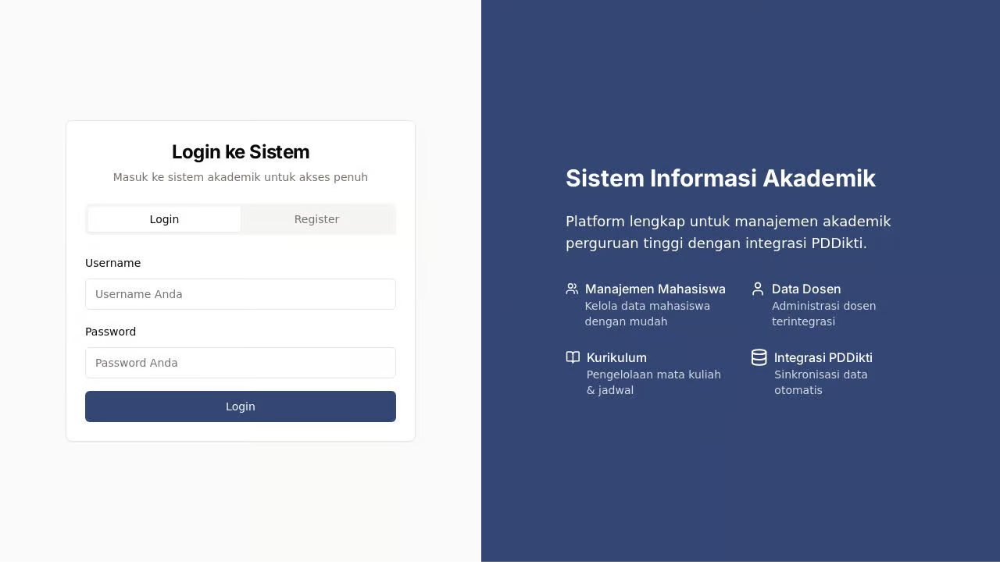

# SIAKAD - Sistem Informasi Akademik dengan Integrasi PDDikti

SIAKAD adalah aplikasi sistem informasi akademik komprehensif untuk perguruan tinggi di Indonesia dengan integrasi lengkap ke Neo Feeder PDDikti. Aplikasi ini dikembangkan menggunakan teknologi modern dan memberikan solusi manajemen akademik yang terintegrasi.



## Fitur Utama

### 1. Manajemen Data Akademik
- **Mahasiswa:** Pengelolaan data mahasiswa, status, dan informasi akademik
- **Dosen:** Manajemen data dosen, bidang keahlian, dan jabatan akademik
- **Mata Kuliah:** Pengelolaan kurikulum, prasyarat, dan distribusi semester
- **Jadwal:** Penjadwalan perkuliahan otomatis dan manajemen ruangan
- **Nilai:** Sistem penilaian berbasis komponen dan konversi nilai

### 2. Integrasi PDDikti
- Sinkronisasi data dengan Neo Feeder PDDikti
- Validasi format data sesuai standar Dikti
- Pelaporan otomatis data akademik

### 3. Administrasi Akademik
- Pendaftaran mata kuliah (KRS)
- Transkrip nilai akademik
- Manajemen kehadiran mahasiswa dan dosen
- Dokumen akademik (surat keterangan, legalisir, dll)

### 4. Keuangan
- Pengelolaan biaya kuliah
- Histori pembayaran
- Tagihan dan notifikasi

## Teknologi

SIAKAD dibangun menggunakan stack teknologi modern:

- **Frontend:** React.js dengan TypeScript dan Vite
- **UI Framework:** Tailwind CSS dan Shadcn UI
- **Backend:** Express.js
- **Database:** PostgreSQL dengan Drizzle ORM
- **Autentikasi:** Sistem autentikasi berbasis session

## Memulai

### Prasyarat
- Node.js 18 atau lebih tinggi
- PostgreSQL
- Akun API PDDikti (untuk integrasi penuh)

### Instalasi

1. Clone repositori
```bash
git clone https://github.com/username/siakad.git
cd siakad
```

2. Instal dependensi
```bash
npm install
```

3. Konfigurasi database
```bash
# Setup variabel lingkungan
cp .env.example .env
# Edit file .env dengan kredensial database Anda
```

4. Migrasi database
```bash
npm run db:push
```

5. Jalankan aplikasi
```bash
npm run dev
```

Aplikasi akan berjalan di `http://localhost:5000`

## Struktur Proyek

```
├── client/               # Kode frontend React
│   ├── src/              # Source code
│   │   ├── components/   # Komponen React
│   │   ├── hooks/        # Custom hooks
│   │   ├── lib/          # Utilitas dan fungsi helper
│   │   ├── pages/        # Komponen halaman
│   │   └── ...
├── server/               # Kode backend Express
│   ├── index.ts          # Entry point
│   ├── routes.ts         # Definisi rute API
│   ├── auth.ts           # Sistem autentikasi
│   ├── db.ts             # Koneksi database
│   ├── storage.ts        # Layer akses data
│   └── pddikti.ts        # Integrasi PDDikti
├── shared/               # Kode yang digunakan bersama
│   └── schema.ts         # Skema database dan validasi
└── ...
```

## Integrasi PDDikti

SIAKAD terintegrasi dengan Neo Feeder PDDikti untuk memenuhi kebutuhan pelaporan data perguruan tinggi ke Kementerian Pendidikan dan Kebudayaan. Integrasi ini memastikan:

1. Data akademik selalu tersinkronisasi antara sistem internal dan PDDikti
2. Format data sesuai dengan standar yang ditetapkan
3. Proses pelaporan lebih efisien dan akurat

## Lisensi

[MIT License](LICENSE)

## Kontak

Untuk pertanyaan atau dukungan, silakan hubungi [email@example.com](mailto:email@example.com)